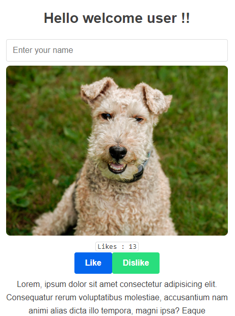
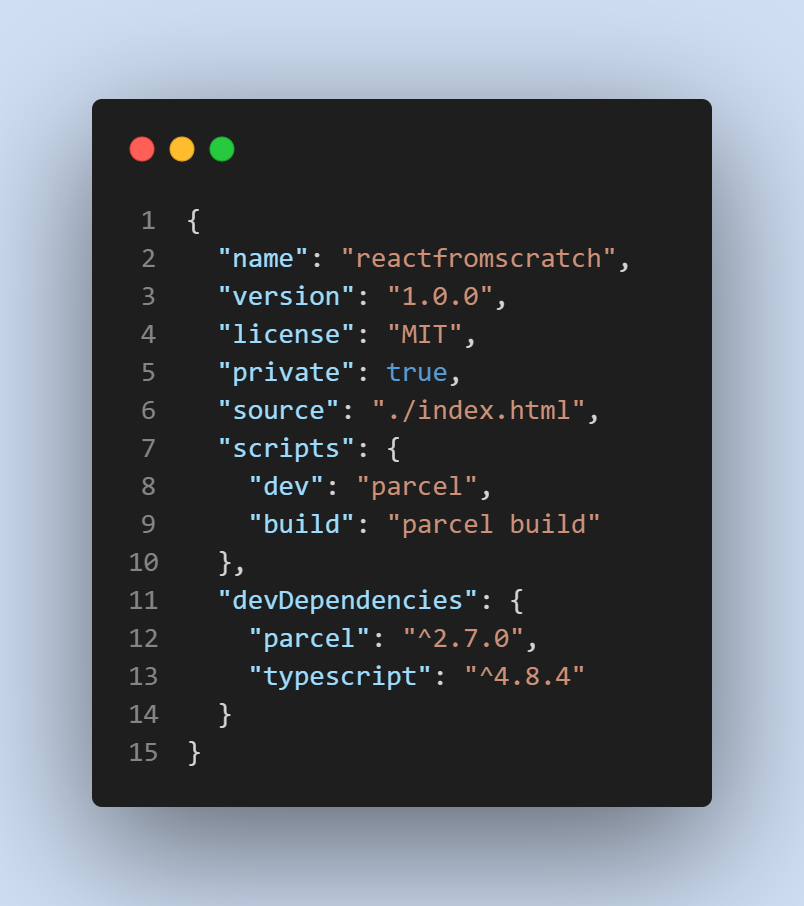

# Creation of React library from 0 ⚛

Tiny project to learn how react works internally(aproximation) using Parcel,
in one file there are definitions of:

- how to create elements and components inside of Virtual-DOM
- render function to paint Virtual-DOM
- useState 
- Suspense simple recreation 

All this is used in a cute reactive count and input text component  

Credits : Tejas (like "contagious" lol) Kumar

## Installation

Clone and run

```bash
  yarn add  
  cd reactfromscratch
  yarn dev
```
---------------


# No react installed !!


