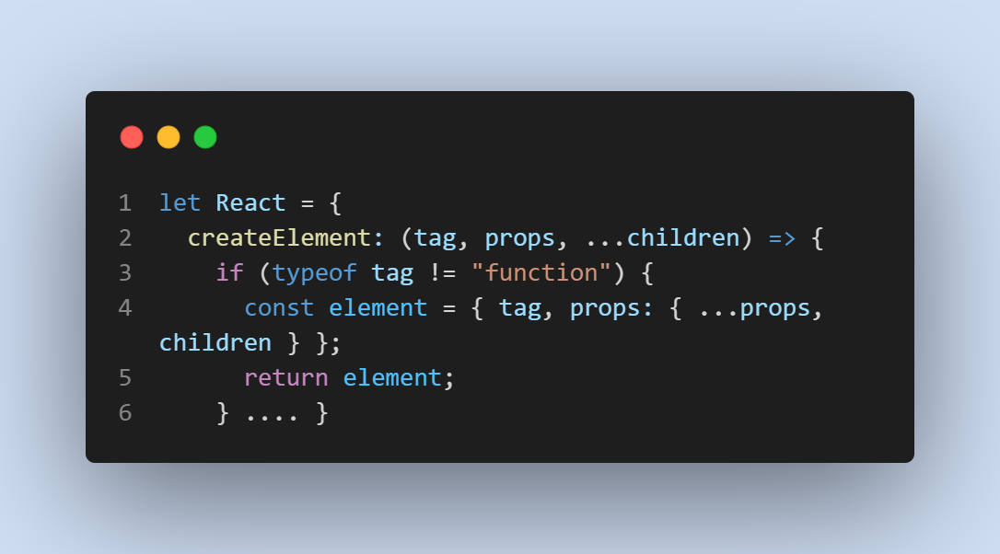

# Creation of React library ⚛

Tiny project to learn how react works, in one file
are definitions of:

- how create elements and components inside Virtual-DOM
- render to paint Virtual-DOM
- useState 
- Suspense simple recreation 

All this is used in cute reactive count and input text 

Credits : Tejas (like "contagious" lol) Kumar

## Installation

Clone and run

```bash
  yarn add  
  cd reactfromscratch
  yarn dev
```


# No react installed !!


